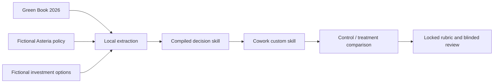

# Investment Committee Copilot

[Türkçe](tr/demos/investment-committee.md)

## Decision

Should fictional Asteria Distribution Group approve a EUR 4.8 million full-
automation proposal, choose a safer option, escalate, reject, or request more evidence?

This demo captures four first-response Cowork UX runs against the same business
question and investment brief:

| Condition | Context |
|---|---|
| Control, two runs | Investment brief only; custom skill absent |
| Treatment, two runs | Same brief; custom skill explicitly invoked and shown as loaded |

Cowork showed Claude Opus 4.8, but did not expose a pinned runtime version. No
conversation-level custom-skill toggle was visible, and automatic discovery did
not load the installed skill. The treatment prompt therefore invokes the skill
explicitly. This is a UX comparison, not a causal A/B.

The treatment is expected to apply Asteria's fictional policy gates, compare the
do-minimum, phased, and requested options, preserve the requested option's
separate disposition, identify missing evidence, route human approvers, and cite
the source of each rule.

## LLM only vs LLM + skill

All four retained runs used Claude Opus 4.8 and the same investment brief.

| What changed | LLM only: brief | LLM + skill: brief + policy/method references |
|---|---|---|
| Recommended option | Phased automation, 2/2 | Phased automation, 2/2 |
| Decision contract | Conditional direction in free prose | Exact `conditional-approval` class |
| Asteria thresholds | Not present in control context | Applied ACP-F01/F02/F03/S01/C01/R01/M01 |
| Requested full option | Risks described | Separate “not approved as presented” disposition |
| Human authority | Generic or unsupported inference | CFO, COO, CIO; CISO/Procurement triggers |
| Provenance | Brief-level references | ACP rule IDs and Green Book sections |
| Remaining weakness | Invented fallback/exception details | Unsupported details remained in both treatment runs |

**Observed skill value:** both conditions found the phased option. The skill
made the recommendation governable by adding the policy tests, separate request
disposition, authority route, and traceable sources. Because those references
were unavailable to the controls, this is an experience comparison rather than
a causal A/B.

## Source-to-skill path

The Green Book provides an appraisal method: objectives, broad option generation,
do-minimum, shortlist comparison, monetisable and unmonetisable effects, risk and
uncertainty, optimism bias, balanced judgement, and monitoring/evaluation. It
does **not** set Asteria's financial or approval thresholds.

Method source: [*The Green Book (2026)*, HM Treasury and Government Finance
Function](https://www.gov.uk/government/publications/the-green-book-appraisal-and-evaluation-in-central-government).
Contains public sector information licensed under the
[Open Government Licence v3.0](https://www.nationalarchives.gov.uk/doc/open-government-licence/version/3/).
All Asteria names, policies, proposals, people, and values are fictional.

## Baseline case

| Option | Commitment | NPV | Payback | Downside NPV | Largest supplier | Result |
|---|---:|---:|---:|---:|---:|---|
| Do minimum | EUR 0.8m | EUR 0.3m | 3.5y | EUR 0.0m | 30% | Fails operational objectives |
| Phased automation | EUR 3.2m | EUR 1.1m | 4.2y | EUR 0.2m | 45% | Meets objectives; training sign-off pending |
| Full automation | EUR 4.8m | EUR 1.6m | 5.4y | EUR -0.7m | 72% | Cyber assessment and fallback absent |

The locked treatment answer key expects conditional approval of phased automation.
The model must earn that result through evidence and policy application rather
than being told to produce a persuasive recommendation.

## Evaluation

Twelve scenarios test clear approval, negative NPV, payback exception, supplier
concentration, cyber evidence, conflicting facts, missing downside evidence,
authority escalation, and no viable option.

The formal evidence release will show:

- raw first-run outputs;
- randomized A/B comparison;
- decision and option accuracy;
- gate coverage and missing-information detection;
- provenance quality;
- unsupported-rule and invented-fact penalties;
- limitations and failed cases.

## Cowork UX observations

Four separate Cowork tasks were retained: two controls and two
explicit-skill treatments. Two operational attempts were excluded: a long-form
prompt that triggered Word generation and a treatment attempt where automatic
discovery did not load the custom skill.

| Observation | Controls | Explicit-skill treatments |
|---|---|---|
| Recommended phased automation | 2/2 | 2/2 |
| ACP thresholds available and applied by rule ID | Not available | Yes |
| Preserved human approval boundary | Yes | Yes |
| Included unsupported details | Yes | Yes |

The second treatment applied all six locked IC-01 policy findings. The first
treatment omitted an explicit ACP-F01 pass. Both treatment responses still made
unsupported claims about missing monitoring measures or other unsupplied
details. The raw first responses are retained rather than repaired or rerun.

Package SHA-256:
`40c4f763cd0ffc30a939cd7a7cda2e58780ea9731eb4a3dc3376c4864168a659`.

### Control capture

[Open the full-size control capture](assets/investment-committee/evidence/screenshots/06-control-2-1920x1080.png)

[Control 1 raw response](assets/investment-committee/evidence/outputs/control-1.txt) ·
[Control 2 raw response](assets/investment-committee/evidence/outputs/control-2.txt)

### Explicit-skill treatment capture

[Open the full-size treatment capture](assets/investment-committee/evidence/screenshots/05-treatment-2-1920x1080.png)

[Treatment 1 raw response](assets/investment-committee/evidence/outputs/treatment-1.txt) ·
[Treatment 2 raw response](assets/investment-committee/evidence/outputs/treatment-2.txt) ·
[Run manifest](assets/investment-committee/evidence/metadata/cowork-runs.json)

Manifest paths are relative to the original manifest directory in the demo
source tree. Use the page links above for published raw assets.

!!! warning "Formal benchmark pending"

    These four captures are Cowork UX observations, not causal evidence or an
    independently validated benchmark. The fixed-model, 12-scenario, three-arm
    evaluation and blinded human review remain pending. Preliminary internal
    rubric rehearsal scores are not presented as performance claims.

## Reproduce

The public release will include one `.skill` file, the fictional investment
brief, separate Cowork control and treatment prompts, the identical formal
evaluation prompt, package SHA-256, setup and teardown instructions, talk track,
expected behavioral checkpoints, and a backup recording.

See the [enterprise delivery plan](ENTERPRISE-DEMO-PLAN.md) for release gates and
the second-demo criteria.