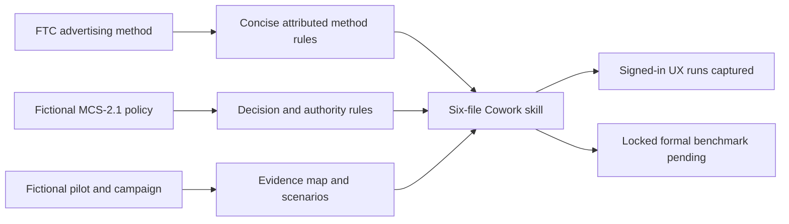

# Marketing Claims Review Copilot

[Türkçe](tr/demos/marketing-claims-review.md)

## Decision

Can fictional Lumena Home Energy release its US digital launch campaign for the
Lumena Sense smart HVAC energy controller as presented, or approve an
evidence-bounded revision?

The locked baseline answer is `approve-with-edits` with
`evidence-bounded-campaign`. The original campaign is not approved as presented.
This is an advisory governance demo, not legal advice or a final legal
conclusion. Human Legal, Compliance, Marketing, and Product Evidence reviewers
retain all authority; Copilot cannot approve or publish.

## LLM only vs LLM + skill

This is the model-matched Cowork pair: both runs used **Claude Opus 4.8** in
separate tasks with the same answer-key-free campaign brief.

| What changed | LLM only: brief | LLM + skill: brief + five references |
|---|---|---|
| Business direction | Chose `evidence-bounded-campaign` | Chose `evidence-bounded-campaign` |
| Decision contract | Free text: “Revise before release” | Exact class: `approve-with-edits` |
| Claim/disclosure inventory | Six combined rows | Seven separately auditable rows |
| Policy application | No MCS policy was available | Applied MCS-C01 through MCS-M01 |
| Evidence provenance | Campaign brief citation | PE-01/02/03, MCS rules, FTC method |
| Human route | Generic legal/regulatory review | Legal, Compliance, Marketing Director, Product Evidence Owner |
| Release controls | Partial; added an unsupplied live-asset trigger | MCS-R01 gates; MCS-M01 unknowns preserved |
| Response word limit | 629 words; within 700 | 862 words; exceeded 700 |

**Observed skill value:** it did not discover a different campaign option. It
converted a sensible content review into a traceable release decision with an
exact class, rule/evidence mapping, named reviewers, and explicit controls.

!!! note "What this comparison does not prove"

    The treatment prompt explicitly invoked the skill and requested its schema;
    the skill also supplied policy and evidence references unavailable to the
    control. This demonstrates the signed-in Cowork experience, not causal model
    uplift. The separate three-arm evaluation will compare scenario-only, raw
    documents, and compiled skill with identical prompts.

## Evidence status

| Asset | Status |
|---|---|
| Six-file Cowork skill package definition | Ready; deterministic packaging covered by test |
| Three-source synthetic case pack | Ready and tracked |
| Three-source FTC method manifest | Ready; public snapshots not tracked |
| Twelve locked scenarios and 14-point rubric | Ready |
| Answer-key-free deterministic scenario renderer | Ready; 12 input hashes locked |
| Presenter setup and expected checkpoints | Ready |
| Signed-in Cowork control | Captured; raw first response retained |
| Final package upload | Captured in Customize as `marketing-claims-review-copilot-3` |
| Signed-in final-package treatment | Captured with Auto and Claude Opus 4.8; first responses retained |
| Fixed-runtime formal benchmark and blinded human review | Pending |

The Cowork UX set now contains one clean brief-only control, one model-matched
Claude Opus 4.8 treatment, and one separate Auto treatment. Four operational
attempts are recorded as excluded. These remain UX observations, not causal or
formal benchmark evidence.

Cowork package SHA-256:
`35e0642d1fdf63f3698419d5b014acab4755d9c50c8dad812d459ac86f902e9b`.

## Clean Cowork control observation

The retained control used only the answer-key-free fictional campaign brief.
It selected the evidence-bounded campaign and found all primary claim problems.
It did not name the permitted `approve-with-edits` class or have access to the
MCS authority matrix. It correctly treated the named compatibility exclusions
as unavailable in its brief-only context. The raw response is retained without
repair.

[Open the full-size control capture](assets/marketing-claims-review/evidence/screenshots/01-control-1-1920x1080.png)

[Control 1 raw response](assets/marketing-claims-review/evidence/outputs/control-1.txt) ·
[Run manifest](assets/marketing-claims-review/evidence/metadata/cowork-runs.json)

Manifest paths are relative to the original manifest directory in the demo
source tree. Use the page links above and below for published raw assets.

## Skill-assisted Cowork observations

Both skill-assisted first responses selected `approve-with-edits`, recommended
the evidence-bounded campaign, inventoried all seven claim/disclosure rows,
applied the MCS authority and release controls, and kept FTC method separate from
synthetic policy. Both exceeded the requested 700-word limit.

[Open the full-size Claude treatment capture](assets/marketing-claims-review/evidence/screenshots/04-treatment-claude-1-1920x1080.png)

[Claude treatment raw response](assets/marketing-claims-review/evidence/outputs/treatment-claude-1.txt) ·
[Auto treatment raw response](assets/marketing-claims-review/evidence/outputs/treatment-auto-1.txt) ·
[Preliminary review record](assets/marketing-claims-review/evidence/metadata/preliminary-review.json)

!!! warning "Preliminary rubric rehearsal — not a formal benchmark"

    A conservative blinded AI-assisted rehearsal scored the model-matched Claude
    treatment 12/14 with no penalties and the brief-only control 7 after one
    penalty. The separate Auto treatment also scored 12/14. Both treatments
    exceeded the requested 700-word limit.
    Human review is not complete. The prompts differ by explicit skill
    invocation, Cowork runtime controls were not fully pinned, and only one of
    12 scenarios was run. Do not interpret these figures as causal uplift,
    statistical estimates, or independently validated performance.

## Source-to-skill path

The FTC publications inform claim, disclosure, and endorsement review methods.
They do not set Lumena policy or replace legal review. MCS-2.1 is synthetic and
sets the demo's decision classes, claim rules, release boundary, and authority.

## Public method sources

- [Advertising and Marketing on the Internet: Rules of the Road](https://www.ftc.gov/system/files/ftc_gov/pdf/bus28-rulesroad-2023_508.pdf),
  16-page PDF served at the pinned FTC URL.
- [.com Disclosures: How to Make Effective Disclosures in Digital Advertising](https://www.ftc.gov/system/files/documents/plain-language/bus41-dot-com-disclosures-information-about-online-advertising.pdf),
  53 pages, March 2013.
- [Guides Concerning the Use of Endorsements and Testimonials in Advertising, 16 CFR Part 255](https://www.ecfr.gov/api/versioner/v1/full/2023-07-26/title-16.xml?part=255),
  date-pinned 2023-07-26 eCFR XML snapshot.

Exact snapshot SHA-256 values are recorded in the source manifest. The public
PDFs and XML are not committed, and the skill compiles concise method rules
rather than copying long passages. US federal government works are generally not
copyrightable under 17 U.S.C. 105, but third-party material and assets must be
checked separately.

All Lumena names, products, policies, people, sources, payments, results, and
campaign facts are fictional synthetic data.

## Baseline claims

| Claim | Supplied evidence fit | Required baseline disposition |
|---|---|---|
| Save 30% on home energy bills | Pilot measured median 12% HVAC electricity reduction, not bills | Replace with exact bounded pilot statement |
| Pays for itself in six months | Payback was not measured | Remove |
| Works in every home | Known equipment exclusions and installation requirements | Remove; show compatibility near CTA |
| Independent pilot proves the savings | Lumena sponsored and analyzed; no independent replication | State company sponsorship; remove independence claim |
| Ava Reed: 35% bill reduction | Dashboard showed 18% HVAC electricity reduction over 8 weeks; no typical-results analysis | Remove the performance endorsement |
| `#LumenaPartner` after collapsed boundary | Paid USD 5,000 and received free device | Put clear paid/device disclosure first and in content |
| Bottom-page `Results vary` footnote | Distant qualification cannot cure contradictory headlines under MCS-2.1 | Replace with close, unavoidable, non-contradictory disclosure |

The evidence-bounded option preserves the exact population, metric, duration,
baseline, result, sponsorship, compatibility conditions, and material-connection
facts without converting an exceptional personal result into a release claim.
Legal, Compliance, Marketing Director, and Product Evidence Owner participation
is required before release.

## Evaluation plan

The signed-in Cowork demonstration will retain first responses from a fresh
control conversation and a fresh explicit-skill-invocation conversation with the
same synthetic brief. This comparison is UX evidence only: explicit invocation
is a treatment choice because automatic discovery and host runtime may not be
pinned.

The formal benchmark is separate. It uses exactly 12 locked scenarios, one
permitted decision class, one campaign option, a maximum positive score of 14,
repeatable penalties, a declared model and parameters, randomized presentation,
and blinded human review. It reports total score, unsupported claim count,
correct abstention, response words, and evidence references only after execution
and review.

Release evidence includes raw first responses, run conditions, package hash,
scenario version, scoring records, exclusions, limitations, and failed cases.
Preliminary rehearsal metrics remain visibly separated from the pending formal
benchmark.

## Human boundary

The skill may inventory claims, map evidence, draft required edits, identify
missing facts, and route reviewers. It does not make a final legal determination
or authorize campaign release, publication, pause, correction, withdrawal, or
monitoring actions.
