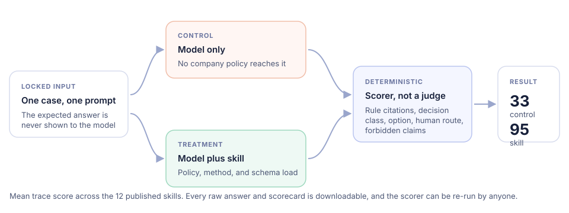
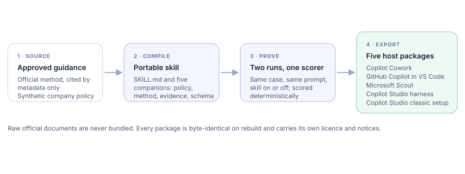

---
hide:
  - navigation
  - toc
---

Governed agent skills

# Decisions your reviewers can audit { .bts-hero__title }

Compile approved guidance into a small, portable Agent Skill that states one
allowed decision class, cites the rule behind every line, keeps unknowns
unknown, and hands the call to a named human. Twelve worked enterprise
decisions, each one measured against the same model without the skill.

[Browse the 12 skills](skills/index.md){ .md-button .md-button--primary }
[See how it works](how-it-works.md){ .md-button }

<ul class="bts-metrics">
  <li><b>12</b>skills, each with 12 locked scenarios</li>
  <li><b>60</b>byte-identical host packages</li>
  <li><b>33 &rarr; 95</b>mean trace score, model alone vs with the skill</li>
  <li><b>24</b>raw answers published for inspection</li>
</ul>

## What changes when the skill is loaded

Every skill in the catalog was tested the same way: the same locked case, the
same prompt, and one difference — the skill was installed for the second run.
Both answers are scored by a script, not a model, so anyone can re-run the
scoring and get the same numbers.

| Measured across all 12 skills | LLM only | LLM + skill |
|---|---|---|
| Mean trace score | 33 / 100 | 95 / 100 |
| Skills citing zero policy rules | 12 of 12 | 0 of 12 |
| Skills stating the exact decision class | 0 of 12 | 9 of 12 |
| Raw answers published | 12 | 12 |

The control runs are not incompetent. They usually reach a sensible business
direction. What they cannot do is cite the company rule identifiers, state the
exact allowed decision class, and route the decision to the named owner, because
none of that reaches the model without the skill.

<figure class="bts-diagram">
<picture>
    <source media="(max-width: 720px)" srcset="../assets/diagrams/evaluation-mobile.svg">
    
</picture>
<figcaption>The evaluation method behind every number on this site. Raw answers, scorecards, and the scorer itself are published.</figcaption>
</figure>

!!! warning "What this does and does not prove"

    This is a per-skill, single-run comparison against locked scenarios, not a
    causal benchmark. Each skill has one control run and one skill run on one
    host, and the skill run legitimately receives the company policy that the
    control never sees. Three of the twelve skill runs chose a more cautious
    decision class than the locked expectation, which is published rather than
    hidden. Two skills additionally carry Microsoft 365 Copilot Cowork
    screenshots and manifests as host-level evidence.

## Where the skills apply

-   :material-shield-account: **Privacy and messaging**

    ---

    KVKK notice review, commercial message decisions, and telecom communication
    data, each bounded by purpose, consent, and retention gates.

-   :material-bank: **Regulated finance**

    ---

    AML customer acceptance, remote bank onboarding, crypto payment gateways,
    and merger notification, routed to the reviewer who must decide.

-   :material-hard-hat: **Safety, health, and market conduct**

    ---

    OHS risk assessment, pharmaceutical promotion, discount price claims, and
    advertising substantiation with explicit release controls.

-   :material-cube-outline: **Any Agent Skills host**

    ---

    Cowork, GitHub Copilot in VS Code, Microsoft Scout, and Copilot Studio in
    two forms — five deterministic packages per skill.

## How a skill is built

<figure class="bts-diagram">
<picture>
    <source media="(max-width: 720px)" srcset="../assets/diagrams/pipeline-mobile.svg">
    
</picture>
<figcaption>Official method by metadata only, a published synthetic company layer, one compiled skill, and five host exports.</figcaption>
</figure>

[Read the method](how-it-works.md){ .md-button }

## Source and independence

The extraction engine underneath is the MIT-licensed
[`book-to-skill`](https://github.com/virgiliojr94/book-to-skill) project. This
downstream adds the Copilot-ecosystem packaging, the governed enterprise
examples, the deterministic evaluation, and the release factory. It is
independently maintained and not endorsed by the upstream author, Microsoft, or
any public authority.

[Safety, source, and reuse boundaries](safety.md)
