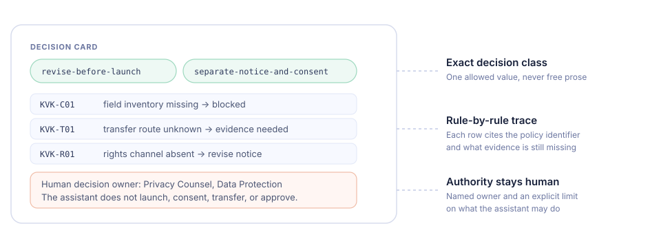

# How it works

[Türkçe](tr/nasil-calisir.md){ .bts-lang }

A skill in this catalog is not a prompt and not a document dump. It is a small,
reviewable package that carries a decision method, the company rules that apply,
the provenance of each claim, and the boundary where a human must decide.

<figure markdown>

<figcaption>Approved guidance is compiled once and exported to every supported host. Raw official documents are never bundled.</figcaption>
</figure>

## 1. Source

Each skill starts from two kinds of input, kept strictly apart.

**Official method.** Legislation and regulator guidance are referenced by
metadata only: title, publisher, official URL, retrieval date, and SHA-256. The
repository ships a short, independently written method summary instead of the
source text, so nothing is redistributed that should not be.

**Company layer.** The operational rules, thresholds, and approval routes are
synthetic and fully published, so the whole example can be inspected and reused
without exposing any real organisation.

## 2. Compile

The compiled skill is always six Markdown files:

| File | Carries |
| --- | --- |
| `SKILL.md` | When to trigger, the workflow, and the hard limits |
| `company-policy.md` | The decision rules with stable identifiers |
| `public-method.md` | The independent summary of the official method |
| `evidence-map.md` | Which claim may be sourced from where |
| `output-schema.md` | The exact shape of the answer |
| `scenario-guide.md` | Missing facts, conflicts, abstention, what-if |

Splitting the skill this way keeps the always-loaded part small; the rest is
read only when the case needs it.

## 3. What the answer looks like

The schema is the point. A governed answer names one allowed decision class,
traces every rule it applied, keeps unknowns unknown, and hands the decision to
a named human.

<figure markdown>

<figcaption>A decision card from the KVKK notice review skill. Rule identifiers, missing evidence, and the human owner are part of the required output, not a stylistic choice.</figcaption>
</figure>

## 4. Prove

Claims about skills are cheap, so every skill in this catalog is measured the
same way and the result is published even when it is unflattering.

<figure markdown>

<figcaption>The control and the skill run answer the same locked case with the same prompt. A script, not a model, scores both.</figcaption>
</figure>

The scorer checks five things that can be verified mechanically: the exact
decision class, the recommended option, citation of every required rule
identifier, a named human route, and the absence of any claim of autonomous
authority. Its criteria are copied from the locked scenario and the release
build fails if they ever drift from it.

```bash
python tools/score_skill_answer.py scorecard --demo demos/kvkk-aydinlatma-kontrolu
```

## 5. Export

One factory validates the catalog and emits five deterministic packages per
skill for Microsoft 365 Copilot Cowork, GitHub Copilot in VS Code, Microsoft
Scout, and Copilot Studio in two forms. A clean rebuild is byte-identical, and
each archive carries its own licence and third-party notices.

## Where this comes from

The extraction engine underneath is the MIT-licensed
[`book-to-skill`](https://github.com/virgiliojr94/book-to-skill) project. This
downstream adds Copilot-ecosystem packaging, the governed enterprise examples,
the deterministic evaluation, and the release factory. The upstream author has
not endorsed it. See [project and source](DOWNSTREAM.md) for the full
relationship and [licensing and reuse](LICENSING-AND-REUSE.md) for what may be
reused.
