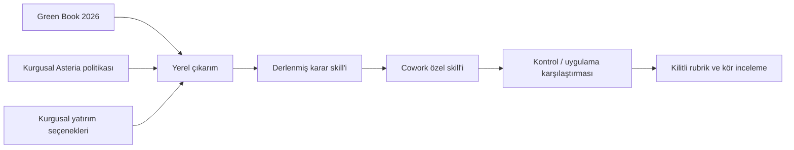

# Yatırım Komitesi Copilot

[English](../../INVESTMENT-COMMITTEE-DEMO.md)

## Karar

Kurgusal Asteria Distribution Group, 4,8 milyon EUR tutarındaki tam otomasyon
önerisini onaylamalı mı; daha güvenli bir seçenek mi seçmeli, konuyu üst makama
mı taşımalı, reddetmeli mi, yoksa daha fazla kanıt mı istemeli?

Bu demo, aynı iş sorusu ve yatırım özeti için ilk yanıttan oluşan dört Cowork
UX koşusunu kaydeder:

| Koşul | Bağlam |
|---|---|
| Kontrol, iki koşu | Yalnız yatırım özeti; özel skill yok |
| Uygulama, iki koşu | Aynı özet; özel skill açıkça çağrıldı ve yüklenmiş olarak gösterildi |

Cowork Claude Opus 4.8'i gösterdi, ancak sabitlenmiş çalışma zamanı sürümünü
açıklamadı. Konuşma düzeyinde özel skill anahtarı görünmüyordu ve otomatik keşif
kurulu skill'i yüklemedi. Bu nedenle uygulama istemi skill'i açıkça çağırır.
Bu bir UX karşılaştırmasıdır, nedensel A/B değildir.

Uygulamanın Asteria'nın kurgusal politika kapılarını kullanması; asgari, aşamalı
ve talep edilen seçenekleri karşılaştırması; talep edilen seçeneğin ayrı hükmünü
koruması; eksik kanıtı belirlemesi; insan onay mercilerine yönlendirmesi ve her
kuralın kaynağını göstermesi beklenir.

## Yalnız LLM ve LLM + skill

Korunan dört koşunun tamamı Claude Opus 4.8 ve aynı yatırım özetini kullandı.

| Değişen unsur | Yalnız LLM: özet | LLM + skill: özet + politika/yöntem kaynakları |
|---|---|---|
| Önerilen seçenek | Aşamalı otomasyon, 2/2 | Aşamalı otomasyon, 2/2 |
| Karar sözleşmesi | Serbest metinde koşullu yön | Kesin `conditional-approval` sınıfı |
| Asteria eşikleri | Kontrol bağlamında yok | ACP-F01/F02/F03/S01/C01/R01/M01 uygulandı |
| Talep edilen tam seçenek | Riskler açıklandı | Ayrı “sunulduğu haliyle onaylanmadı” hükmü |
| İnsan yetkisi | Genel veya desteksiz çıkarım | CFO, COO, CIO; CISO/Procurement tetikleyicileri |
| Kaynak izi | Özet düzeyinde kaynaklar | ACP kural ID'leri ve Green Book bölümleri |
| Kalan zayıflık | Uydurulmuş geri dönüş/istisna ayrıntıları | Desteksiz ayrıntılar iki uygulama koşusunda da kaldı |

**Gözlenen skill değeri:** iki koşul da aşamalı seçeneği buldu. Skill; politika
testlerini, talep için ayrı hükmü, yetki rotasını ve izlenebilir kaynakları
ekleyerek öneriyi yönetilebilir hale getirdi. Bu kaynaklar kontrollere açık
olmadığı için karşılaştırma nedensel A/B değil, deneyim karşılaştırmasıdır.

## Kaynaktan skill'e giden yol

Green Book şu değerlendirme yöntemini sağlar: hedefler, geniş seçenek üretimi,
asgari seçenek, kısa liste karşılaştırması, paraya çevrilebilen ve çevrilemeyen
etkiler, risk ve belirsizlik, iyimserlik yanlılığı, dengeli muhakeme ve
izleme/değerlendirme. Asteria'nın finansal veya onay eşiklerini **belirlemez**.

Yöntem kaynağı: [*The Green Book (2026)*, HM Treasury and Government Finance
Function](https://www.gov.uk/government/publications/the-green-book-appraisal-and-evaluation-in-central-government).
[Open Government Licence v3.0](https://www.nationalarchives.gov.uk/doc/open-government-licence/version/3/)
altında lisanslanan kamu sektörü bilgilerini içerir. Tüm Asteria adları,
politikaları, önerileri, kişileri ve değerleri kurgusaldır.

## Temel vaka

| Seçenek | Taahhüt | NPV | Geri ödeme | Aşağı yönlü NPV | En büyük tedarikçi | Sonuç |
|---|---:|---:|---:|---:|---:|---|
| Asgari | EUR 0.8m | EUR 0.3m | 3.5y | EUR 0.0m | 30% | Operasyonel hedefleri karşılamıyor |
| Aşamalı otomasyon | EUR 3.2m | EUR 1.1m | 4.2y | EUR 0.2m | 45% | Hedefleri karşılıyor; eğitim onayı beklemede |
| Tam otomasyon | EUR 4.8m | EUR 1.6m | 5.4y | EUR -0.7m | 72% | Siber değerlendirme ve geri dönüş planı yok |

Kilitli uygulama cevap anahtarı, aşamalı otomasyonun koşullu onayını bekler.
Model bu sonucu ikna edici bir öneri üretmesi söylenerek değil, kanıt ve politika
uygulamasıyla kazanmalıdır.

## Değerlendirme

On iki senaryo; açık onayı, negatif NPV'yi, geri ödeme istisnasını, tedarikçi
yoğunlaşmasını, siber kanıtı, çelişkili olguları, eksik aşağı yönlü kanıtı, yetki
eskalasyonunu ve uygulanabilir seçenek bulunmamasını test eder.

Resmî kanıt yayını şunları gösterecektir:

- ham ilk koşu çıktıları;
- rastgeleleştirilmiş A/B karşılaştırması;
- karar ve seçenek doğruluğu;
- kapı kapsamı ve eksik bilgi tespiti;
- kaynak izi kalitesi;
- desteksiz kural ve uydurulmuş olgu cezaları;
- sınırlamalar ve başarısız vakalar.

## Cowork UX gözlemleri

Dört ayrı Cowork görevi korundu: iki kontrol ve skill'in açıkça çağrıldığı iki
uygulama. İki operasyonel deneme dışlandı: Word üretimini tetikleyen uzun biçimli
bir istem ve otomatik keşfin özel skill'i yüklemediği bir uygulama denemesi.

| Gözlem | Kontroller | Skill'in açıkça çağrıldığı uygulamalar |
|---|---|---|
| Aşamalı otomasyon önerildi | 2/2 | 2/2 |
| ACP eşikleri mevcut ve kural ID'siyle uygulandı | Mevcut değil | Evet |
| İnsan onay sınırı korundu | Evet | Evet |
| Desteksiz ayrıntılar içerdi | Evet | Evet |

İkinci uygulama kilitli altı IC-01 politika bulgusunun tamamını kullandı. İlk
uygulama açık bir ACP-F01 geçişini atladı. İki uygulama yanıtı da eksik izleme
ölçümleri veya sağlanmamış başka ayrıntılar hakkında desteksiz iddialarda bulundu.
Ham ilk yanıtlar düzeltilmeden veya yeniden koşturulmadan korundu.

Paket SHA-256:
`40c4f763cd0ffc30a939cd7a7cda2e58780ea9731eb4a3dc3376c4864168a659`.

### Kontrol kaydı

[Tam boyutlu kontrol kaydını aç](../../assets/investment-committee/evidence/screenshots/06-control-2-1920x1080.png)

[Kontrol 1 ham yanıtı](../../assets/investment-committee/evidence/outputs/control-1.txt) ·
[Kontrol 2 ham yanıtı](../../assets/investment-committee/evidence/outputs/control-2.txt)

### Skill'in açıkça çağrıldığı uygulama kaydı

[Tam boyutlu uygulama kaydını aç](../../assets/investment-committee/evidence/screenshots/05-treatment-2-1920x1080.png)

[Uygulama 1 ham yanıtı](../../assets/investment-committee/evidence/outputs/treatment-1.txt) ·
[Uygulama 2 ham yanıtı](../../assets/investment-committee/evidence/outputs/treatment-2.txt) ·
[Koşu manifesti](../../assets/investment-committee/evidence/metadata/cowork-runs.json)

Manifest yolları, demo kaynak ağacındaki özgün manifest klasörüne göredir.
Yayımlanmış ham varlıklar için yukarıdaki sayfa bağlantılarını kullanın.

!!! warning "Resmî kıyaslama beklemede"

    Bu dört kayıt Cowork UX gözlemidir; nedensel kanıt veya bağımsız doğrulanmış
    kıyaslama değildir. Sabit modelli, 12 senaryolu, üç kollu değerlendirme ve
    kör insan incelemesi beklemededir. Ön iç rubrik prova skorları performans
    iddiası olarak sunulmaz.

## Yeniden üretme

Kamusal yayın; bir `.skill` dosyasını, kurgusal yatırım özetini, ayrı Cowork
kontrol ve uygulama istemlerini, özdeş resmî değerlendirme istemini, paket
SHA-256 değerini, kurulum ve kaldırma talimatlarını, sunum metnini, beklenen
davranış kontrol noktalarını ve yedek kaydı içerecektir.

Yayın kapıları ve ikinci demo ölçütleri için [kurumsal teslimat planına](../../ENTERPRISE-DEMO-PLAN.md)
bakın.